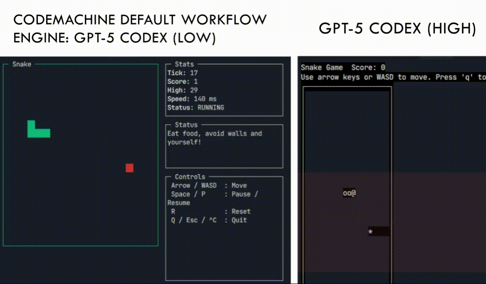
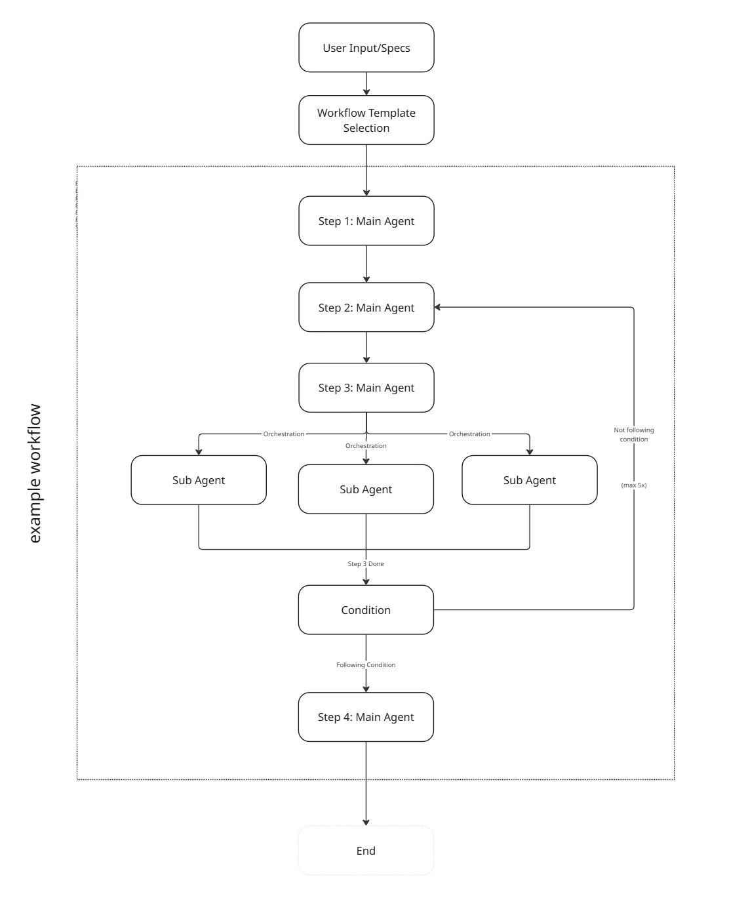

<p align="center">
  
</p>

## Multi-Agent Workflow Orchestration

> **✨ CodeMachine Built Itself**
>
> **90% of this entire codebase was generated by CodeMachine from a single specification file.**
> This isn't a demo—it's proof. CodeMachine orchestrated its own architecture, planning, implementation, and testing.

<p align="center">
  
</p>

### What is CodeMachine CLI?

CodeMachine CLI is a multi-agent workflow orchestration framework that transforms project specifications into production-ready codebases. Unlike single-agent tools, CodeMachine coordinates multiple AI providers (Claude, Codex, Gemini) to work in parallel, each handling tasks they excel at—while you define the workflow.

**Why CodeMachine?**

- **🔄 Custom Workflows**: Design orchestration workflows for any complexity—from simple scripts to multi-day development cycles
- **🤝 Multi-Agent Collaboration**: Mix AI providers strategically (Gemini plans, Claude builds, Codex reviews)
- **⚡ Parallel Execution**: Sub-agents work simultaneously for 10x faster output
- **🎯 Endless Orchestration**: Workflows run for hours or days to achieve complex goals automatically

---

## 🚀 Quick Start

Get CodeMachine up and running in minutes:

### 1. Install CodeMachine

```bash
npm install -g codemachine
```

### 2. Run CodeMachine

Navigate to your project directory and run:

```bash
cd ~/your-project-directory
codemachine
```

On first run, CodeMachine creates a `.codemachine/` folder. Write your project requirements in `.codemachine/inputs/specifications.md`, choose a workflow template, and watch as CodeMachine orchestrates specialized agents to:
- Design your system architecture
- Generate implementation plans
- Write production-ready code
- Create automation scripts
- Validate outputs against your specs

### Supported AI Engines

<table align="center" style="width: 80%; margin: 0 auto;">
  <tr>
    <th align="center" style="padding: 12px; font-size: 16px;">CLI Engine</th>
    <th align="center" style="padding: 12px; font-size: 16px;">Status</th>
    <th align="center" style="padding: 12px; font-size: 16px;">Main Agents</th>
    <th align="center" style="padding: 12px; font-size: 16px;">Sub Agents</th>
    <th align="center" style="padding: 12px; font-size: 16px;">Orchestrate</th>
  </tr>
  <tr>
    <td align="center" style="padding: 10px; font-size: 15px;"><strong>Codex CLI</strong></td>
    <td align="center" style="padding: 10px; font-size: 15px;">✅ Supported</td>
    <td align="center" style="padding: 10px; font-size: 15px;">✅</td>
    <td align="center" style="padding: 10px; font-size: 15px;">✅</td>
    <td align="center" style="padding: 10px; font-size: 15px;">✅</td>
  </tr>
  <tr>
    <td align="center" style="padding: 10px; font-size: 15px;"><strong>Claude Code</strong></td>
    <td align="center" style="padding: 10px; font-size: 15px;">✅ Supported</td>
    <td align="center" style="padding: 10px; font-size: 15px;">✅</td>
    <td align="center" style="padding: 10px; font-size: 15px;">✅</td>
    <td align="center" style="padding: 10px; font-size: 15px;">✅</td>
  </tr>
  <tr>
    <td align="center" style="padding: 10px; font-size: 15px;"><strong>Gemini CLI</strong></td>
    <td align="center" style="padding: 10px; font-size: 15px;">🚧 Coming Soon</td>
    <td align="center" style="padding: 10px; font-size: 15px;">🚧</td>
    <td align="center" style="padding: 10px; font-size: 15px;">🚧</td>
    <td align="center" style="padding: 10px; font-size: 15px;">🚧</td>
  </tr>
  <tr>
    <td align="center" style="padding: 10px; font-size: 15px;"><strong>Qwen Coder</strong></td>
    <td align="center" style="padding: 10px; font-size: 15px;">🚧 Coming Soon</td>
    <td align="center" style="padding: 10px; font-size: 15px;">🚧</td>
    <td align="center" style="padding: 10px; font-size: 15px;">🚧</td>
    <td align="center" style="padding: 10px; font-size: 15px;">🚧</td>
  </tr>
</table>

**That's it!** Your complete codebase will be generated and ready to ship.

---

## 🎮 Real-World Example: Snake Game

We wrote a simple specification for a classic snake game:

```markdown
# Snake Game Specification

## Goal
Create a classic snake game that runs in the terminal or browser.

## Core Features
- Snake moves continuously in a direction (up, down, left, right)
- Player controls direction using arrow keys or WASD
- Snake grows longer when eating food
- Food spawns randomly on the grid
- Game ends when snake hits wall or itself
- Display current score (length of snake)

## Technical Requirements
- Game grid: 20x20 cells
- Initial snake length: 3 segments
- Game speed: 100-200ms per frame
```

<p align="center">
  
</p>

**The comparison speaks for itself:** GPT-5 Codex (High) alone vs. CodeMachine's default workflow powered by GPT-5 Codex (Low). The quality gap is massive. Multi-agent workflow orchestration delivers production-ready results that far exceed what single-agent generation can achieve—even with a more powerful model.

---

## 🛠️ How It Works

<p align="center">
  
</p>

CodeMachine orchestrates workflows through sequential main agent steps and parallel sub-agent execution. After selecting a workflow template, the main agent processes each step in order. When sub-agents are triggered, they work simultaneously on specialized tasks (e.g., frontend, backend, database), then results flow back into the main workflow. Conditional loops allow workflows to iterate until completion criteria are met.

**Example Workflow:**

```javascript
export default {
  name: 'E-Commerce Platform Builder',
  steps: [
    resolveStep('arch-agent', { engine: 'claude' }),        // Claude designs system architecture
    resolveStep('plan-agent', { engine: 'claude' }),        // Claude creates detailed implementation plan
    resolveStep('code-generation', { engine: 'codex' }),    // Codex generates implementation
    resolveStep('runtime-prep', { engine: 'codex' }),       // Codex creates automation scripts
    resolveStep('quality-check', { engine: 'codex' }),      // Codex reviews code quality and runtime
    resolveModule('check-task', {                           // Loop until all tasks complete
      loopTrigger: 'TASKS_COMPLETED=FALSE',
      loopMaxIterations: 15
    }),
  ],
  subAgentIds: ['payment-agent', 'inventory-agent', 'auth-agent'], // Sub-agents work in parallel
};
```
---
