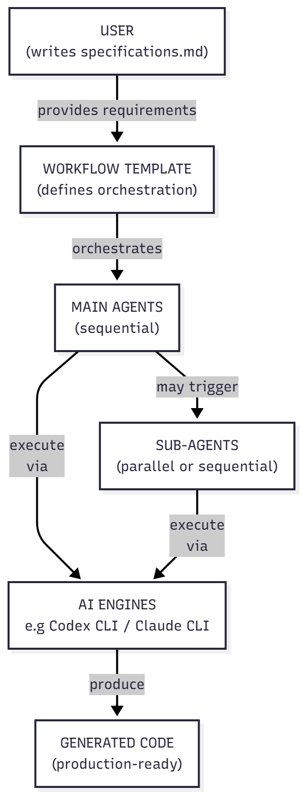
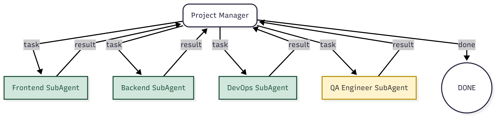
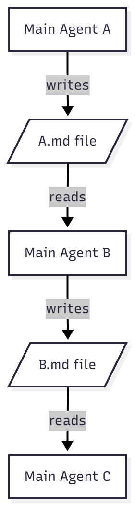

# Overview

**CodeMachine is an orchestration platform that lets you achieve any complex coding objective through customizable agent workflows. Whether you need to refactor a legacy system, migrate between frameworks, generate documentation, or create entirely new applications, the platform provides the infrastructure to coordinate specialized AI agents for any coding task.**

**CodeMachine's default workflow template enables you to transform specifications directly into production-ready codebases, providing immediate value out of the box. Beyond this foundation, the platform's extensible architecture empowers you to craft custom workflows tailored to your unique development pipeline and requirements.**

## Who It's For

CodeMachine is built for developers, tech leads, and engineering teams who want to accelerate development without sacrificing code quality or architectural consistency.

## What You Can Achieve

### For Individual Developers

- **Full applications generated** - Complete codebases ready for production
- **Zero boilerplate writing** - Focus on features, not setup

### For Engineering Teams

- **Orchestrate any workflow** - From simple tasks to complex migrations
- **Shared agent context** - File-based or memory context preservation
- **Grow without limits** - Same tool for 500 or 10,000 file projects

---

# Quick Start

## Prerequisites
Before starting, ensure your environment meets these requirements:

| Requirement | Minimum Version | Notes |
|------------|----------------|-------|
| Node.js | 20.10.0 | Required for running CodeMachine CLI |
| npm | 9.0.0 | Package manager (pnpm also supported) |
| AI Engine CLI | Latest | At least one: Codex CLI, Claude Code CLI, Cursor CLI, CCR CLI, or OpenCode CLI |

## Get your first project generated

```bash
# Install CodeMachine
npm install -g codemachine
```

```bash
# Run CodeMachine inside your project folder
cd my-awesome-project
codemachine
```

Write a sample specifications:
```
Create a small, single-user to-do application that MUST support create, read, update, and delete operations.
```

```bash
# Run the workflow inside CodeMachine shell
/start
```

**Note:** You can use `--spec <path>` to specify a custom specification file path (Default: `.codemachine/inputs/specifications.md`)

# How CodeMachine Works

CodeMachine's core innovation is breaking down complex coding workflows into small, manageable tasks that AI agents can effectively handle. Instead of overwhelming a single agent with an entire project specification—which often fails due to context limitations and complexity—the platform uses workflow templates to decompose work into discrete, achievable steps.

The workflow template establishes a sequence of steps, with each step representing a main agent. These main agents can invoke sub-agents through prompt-driven commands to complete various tasks. Main agents have full capability to write code and orchestrate complex operations, and can utilize sub-agents as needed - though both main and sub-agents are capable of handling any type coding of task.

<p align="center">
  
</p>

# Agents in CodeMachine

## Overview

CodeMachine's workflow system is built around three fundamental components: **Main Agents**, **Sub Agents**, and **Modules**. These components work together to execute complex, multi-step workflows with specialized capabilities and intelligent orchestration.

---

## Main Agents

Main agents serve as the primary execution steps in a workflow. Each main agent represents a discrete phase or task in your development process.

### Key Characteristics
- **Workflow Steps**: A main agent is a step in the workflow execution
- **Orchestration Capability**: Can delegate tasks to and coordinate sub agents
- **Module Integration**: Can leverage specialized modules for advanced workflow behaviors

---

## Sub Agents

Sub agents are specialized agents that operate under the coordination of main agents. They provide focused expertise and can be dynamically invoked based on workflow requirements.

### Key Characteristics
- **Orchestrated Execution**: Called and managed by main agents
- **Specialized Focus**: Designed for specific tasks or domains
- **Same Structure**: Share the same core properties as main agents

---

## Modules

Modules are specialized workflow components that are implemented as agents but trigger specific execution behaviors.

### What Modules Enable
- **Conditional Logic**: Trigger specific agents based on runtime conditions
- **Loop Constructs**: Implement iterative workflows (e.g., back loop steps)
- **Dynamic Routing**: Direct execution flow based on intermediate results

---

## Agent Properties

Every agent (both main and sub) is defined by four core properties:

### 1. Identity
- **Unique ID**: A distinct identifier for the agent
- **Descriptive Name**: A human-readable name that conveys the agent's role

### 2. Purpose
A focused description that clearly defines the agent's role and responsibilities within the workflow.

### 3. Prompt
Path to a prompt template file that defines the agent's behavior, instructions, and operational context. This template guides the AI's actions when executing as this agent.

### 4. AI Profile
Configuration settings that control the AI engine:
- **model**: Specifies which AI model to use for this agent
- **modelReasoningEffort**: Controls the reasoning depth and execution approach

---

## Dynamic Agent Generation

Main agents are defined using carefully engineered prompts with built-in guard rails to ensure consistent and reliable performance. In contrast, sub-agent prompts can be optionally generated by the main agents themselves. For example, an agent builder main agent can create specialized sub-agents on-demand, crafting their prompts with project-specific backgrounds and instructions tailored to the exact requirements of the current task. This dynamic prompt generation capability allows the system to adapt and create perfectly suited sub-agents for each unique project context.

<p align="center">
  
</p>

---

# Agent Communication Patterns

## 1. Sequential Hierarchical Communication
**Pattern:** Main Agents Sequential Execution

### Overview
This pattern enables a linear workflow where multiple main agents execute in a predetermined sequence, with each agent completing its task before triggering the next agent in the chain.

<p align="center">
  
</p>

### What You Can Achieve
- **Phased Development Workflows**: Perfect for projects requiring distinct phases (e.g., design → implementation → testing)
- **Dependency Management**: Ensures tasks with strict dependencies are executed in the correct order
- **Progressive Refinement**: Each agent can build upon the output of the previous one, refining and enhancing the codebase
- **Checkpoint Validation**: Natural breakpoints between agents allow for validation and quality checks

---

## 2. Parent-Child Agent-to-Agent Communication
**Pattern:** Main Agent with SubAgent Delegation

### Overview
The main agent acts as an orchestrator, delegating specific tasks to specialized SubAgents while maintaining overall control and context management.

### Implementation Examples

#### a. **Basic Parent-Child Call**
- Main agent identifies a specialized task (e.g., frontend component generation)
- Delegates to appropriate SubAgent with specific context
- Receives results and integrates them into the broader workflow
- **Achievement**: Modular task execution with specialized expertise

<p align="center">
  
</p>

#### b. **Multi-SubAgent Coordination** (Parallel or Sequential)
- Main agent analyzes project requirements
- Spawns multiple SubAgents for different components (Frontend, Backend, DevOps)
- Can execute SubAgents in parallel for independent tasks or sequentially for dependent ones
- Main agent acts as evaluator, ensuring consistency across all outputs
- **Achievement**: Rapid development through parallel execution while maintaining architectural coherence

<p align="center">
  
</p>

#### c. **Orchestrated Evaluation Workflow** (Context Manager Pattern)
- Main agent initiates parallel execution (green-colored agents in diagram)
- Multiple SubAgents work simultaneously on their domains
- Upon completion, a specialized evaluator agent (yellow-colored) is called sequentially
- Evaluator reviews all parallel outputs for quality, consistency, and integration readiness
- **Achievement**: Quality assurance through peer review while maximizing throughput

<p align="center">
  
</p>

### What You Can Achieve
- **Dynamic Task Distribution**: Automatically scale agent deployment based on project complexity
- **Specialized Expertise**: Each SubAgent can be optimized for specific technologies or frameworks
- **Bidirectional Communication**: SubAgents can request clarification or additional context from the parent
- **Adaptive Workflows**: Runtime adjustment of agent configuration based on intermediate results
- **Comprehensive Testing**: QA SubAgent can validate work from all other agents before final delivery
- **Resource Optimization**: Parallel execution for independent tasks, sequential for dependent operations

### Advanced Capabilities
- **Context Preservation**: Main agent maintains global project context while SubAgents focus on local optimization
- **Error Recovery**: If a SubAgent fails, the main agent can retry with modified parameters or delegate to an alternative agent
- **Progressive Enhancement**: Start with basic implementation, then layer additional SubAgents for optimization, security, and performance
- **Cross-Domain Integration**: Coordinate between different technology stacks through specialized SubAgents

# Agent Context Management Types

## 1. File-Based Main Agent Memory

### Overview
File-based memory enables persistent context sharing between agents through structured file systems, allowing complex workflows to maintain state and share information across multiple agent executions.

### a. Standard Workflow Memory (JSON-Based)

#### How It Works
- After each agent completes its task, a structured memory file (JSON) is automatically created
- Contains execution metadata, outputs, decisions, and key context points
- Subsequent agents can query this memory repository to retrieve relevant context
- Memory files are indexed and searchable for efficient context retrieval

#### What You Can Achieve
- **Historical Context Preservation**: Maintain complete execution history across agent runs
- **Intelligent Context Retrieval**: Agents can search previous executions for similar patterns or solutions
- **Prompt-Driven Context Loading**: Dynamically load specific context based on current task requirements
- **Debugging & Auditing**: Complete trace of all agent decisions and outputs for troubleshooting

### b. Markdown File Pipeline (Sequential Context Transfer)

#### How It Works
- Main Agent A generates comprehensive markdown documentation (A.md)
- Main Agent B reads A.md directly through prompt placeholders
- Agent B processes and enhances, creating B.md with accumulated knowledge
- Chain continues with each agent building upon previous documentation

#### What You Can Achieve
- **Progressive Documentation**: Each agent adds layers of detail and refinement
- **Structured Knowledge Transfer**: Markdown format ensures human-readable context
- **Template-Based Generation**: Use placeholders in prompts for dynamic content injection
- **Version Control Friendly**: Markdown files integrate seamlessly with Git workflows

<p align="center">
  
</p>

---

## 2. Orchestrator Agent Session Memory

### Overview
In parent-child communication patterns, the orchestrator (main agent) maintains centralized session memory, enabling sophisticated coordination and context management across multiple SubAgents.

### How It Works
- Main Agent initiates SubAgent with specific task and context
- SubAgent processes task within its specialized domain
- **Session memory returns to Main Agent** with:
  - Task results
  - Learned patterns
  - Decisions made
  - Potential issues or recommendations
- Main Agent integrates session memory into global context
- Continues execution with enriched understanding

<p align="center">
  
</p>

### What You Can Achieve

#### **Centralized Intelligence**
- Main agent becomes progressively smarter as it accumulates SubAgent insights
- Cross-domain learning: Frontend discoveries can inform Backend decisions
- Pattern recognition across multiple SubAgent executions

#### **Dynamic Adaptation**
- Adjust subsequent SubAgent parameters based on accumulated session memory
- Redistribute tasks if certain approaches prove unsuccessful
- Real-time workflow optimization based on intermediate results

#### **Context Propagation**
- Selective context sharing: Only relevant portions sent to each SubAgent
- Prevents context pollution while maintaining necessary information
- Efficient memory usage through intelligent filtering

#### **Quality Assurance**
- Main agent can validate SubAgent outputs against accumulated context
- Detect inconsistencies or conflicts between different SubAgent results
- Ensure architectural coherence across all components

### Advanced Capabilities

#### **Bidirectional Learning**
- SubAgents can query main agent for clarification
- Main agent updates global strategy based on SubAgent feedback
- Continuous refinement loop throughout execution

#### **Parallel Session Merging**
- When multiple SubAgents run in parallel, session memories merge intelligently
- Conflict resolution strategies for contradictory findings
- Consensus building across multiple agent perspectives

#### **Checkpoint & Recovery**
- Session memory enables resumption from any point
- Failed SubAgent tasks can be retried with adjusted parameters
- Partial results preserved even in failure scenarios
