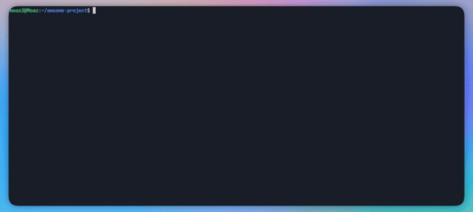

<p align="center">
  <strong>CodeMachine CLI</strong> is an autonomous multi-agent platform that works locally on your computer, turning specifications into production-ready code.<br></p>

<p align="center">
  <code>npm i -g codemachine</code>
</p>

<p align="center">
  
</p>


<p align="center">
  <strong>✨ CodeMachine Built Itself</strong>
</p>

<p align="center">
  <strong>90% of this entire codebase was generated by CodeMachine from a single specification file.</strong><br>
  This isn't a demo—it's proof. CodeMachine engine orchestrated its own architecture, planning, implementation, and testing—creating a massively scalable codebase ready for continuous updates and improvements.
</p>


---

## **What is CodeMachine?**

CodeMachine is a CLI-native orchestration platform that transforms specification files and contextual inputs into production-ready code through coordinated multi-agent workflows. Specialized AI agents operate in hierarchical and parallel configurations with the ability for bidirectional communication, enabling runtime-adaptable methodologies that dynamically adjust to project requirements without framework modifications.


**Why CodeMachine?**

*   **Customizable, End-to-End Workflows:** Architect sophisticated orchestration pipelines for any scale, from executing simple scripts to managing multi-day, complex development cycles.
*   **Strategic Multi-Agent Collaboration:** Leverage a heterogeneous multi-agent system by assigning specialized models to specific tasks—for instance, using Gemini for planning, Claude for implementation, and another model for code review.
*   **Massively Parallel Execution:** Achieve significantly accelerated output by deploying sub-agents that operate simultaneously on different components of a task.
*   **Persistent, Long-Running Orchestration:** Execute workflows for extended durations—hours or even days—to autonomously accomplish complex, long-term development goals.
---

## 🚀 Quick Start

### **Installing and running CodeMachine CLI**

First, install the command-line tool globally via npm:
```bash
npm install -g codemachine
```

Then, simply run `codemachine` in your project directory to get started.
```bash
codemachine
```
### **Initializing a Project**

 CodeMachine initializes a `.codemachine/` workspace. To start **add your specs** to the `inputs/specifications.md` file, then **run `/start`** and watch the magic happen, CodeMachine will:
 *   **Architect a complete system blueprint from your requirements.**
 *   **Formulate detailed, step-by-step execution plans.**
 *   **Engineer clean, production-grade code for every component.**
 *   **Generate essential automation for testing and deployment.**
 *   **Integrate rigorous validation checks across every phase of execution.**

### Supported AI Engines

CodeMachine requires at least one CLI-based AI engine to handle the primary roles of planning and writing code, and is designed to orchestrate multiple engines to collaborate within a single workflow. The table below shows the current status of supported engines and their platform compatibility.


<table align="center" style="width: 80%; margin: 0 auto;">
  <tr>
    <th align="center" style="padding: 12px; font-size: 16px;">CLI Engine</th>
    <th align="center" style="padding: 12px; font-size: 16px;">Status</th>
    <th align="center" style="padding: 12px; font-size: 16px;">Windows</th>
    <th align="center" style="padding: 12px; font-size: 16px;">macOS</th>
    <th align="center" style="padding: 12px; font-size: 16px;">Linux</th>
  </tr>
  <tr>
    <td align="center" style="padding: 10px; font-size: 15px;"><strong>Codex CLI</strong></td>
    <td align="center" style="padding: 10px; font-size: 15px;">✅ Supported</td>
    <td align="center" style="padding: 10px; font-size: 15px;">⚠️</td>
    <td align="center" style="padding: 10px; font-size: 15px;">✅</td>
    <td align="center" style="padding: 10px; font-size: 15px;">✅</td>
  </tr>
  <tr>
    <td align="center" style="padding: 10px; font-size: 15px;"><strong>Claude Code</strong></td>
    <td align="center" style="padding: 10px; font-size: 15px;">✅ Supported</td>
    <td align="center" style="padding: 10px; font-size: 15px;">✅</td>
    <td align="center" style="padding: 10px; font-size: 15px;">✅</td>
    <td align="center" style="padding: 10px; font-size: 15px;">✅</td>
  </tr>
  <tr>
    <td align="center" style="padding: 10px; font-size: 15px;"><strong>CCR (Claude Code Router)</strong></td>
    <td align="center" style="padding: 10px; font-size: 15px;">✅ Supported</td>
    <td align="center" style="padding: 10px; font-size: 15px;">✅</td>
    <td align="center" style="padding: 10px; font-size: 15px;">✅</td>
    <td align="center" style="padding: 10px; font-size: 15px;">✅</td>
  </tr>
  <tr>
    <td align="center" style="padding: 10px; font-size: 15px;"><strong>OpenCode CLI</strong></td>
    <td align="center" style="padding: 10px; font-size: 15px;">✅ Supported</td>
    <td align="center" style="padding: 10px; font-size: 15px;">✅</td>
    <td align="center" style="padding: 10px; font-size: 15px;">✅</td>
    <td align="center" style="padding: 10px; font-size: 15px;">✅</td>
  </tr>
  <tr>
    <td align="center" style="padding: 10px; font-size: 15px;"><strong>Cursor CLI</strong></td>
    <td align="center" style="padding: 10px; font-size: 15px;">✅ Supported</td>
    <td align="center" style="padding: 10px; font-size: 15px;">❌</td>
    <td align="center" style="padding: 10px; font-size: 15px;">✅</td>
    <td align="center" style="padding: 10px; font-size: 15px;">✅</td>
  </tr>
  <tr>
    <td align="center" style="padding: 10px; font-size: 15px;"><strong>Gemini CLI</strong></td>
    <td align="center" style="padding: 10px; font-size: 15px;">🚧 Coming Soon</td>
    <td align="center" style="padding: 10px; font-size: 15px;">✅</td>
    <td align="center" style="padding: 10px; font-size: 15px;">✅</td>
    <td align="center" style="padding: 10px; font-size: 15px;">✅</td>
  </tr>
<tr>
    <td align="center" style="padding: 10px; font-size: 15px;"><strong>Qwen Coder</strong></td>
    <td align="center" style="padding: 10px; font-size: 15px;">🚧 Coming Soon</td>
    <td align="center" style="padding: 10px; font-size: 15px;">✅</td>
    <td align="center" style="padding: 10px; font-size: 15px;">✅</td>
    <td align="center" style="padding: 10px; font-size: 15px;">✅</td>
  </tr>
</table>

<p align="center">
  <em>✅ Fully Supported  |  ⚠️ Not Officially Supported  |  ❌ Not Available</em>
</p>

### OpenCode CLI Integration

OpenCode ships as a first-class engine. Install the CLI with `npm i -g opencode-ai@latest` (or `brew install opencode`, `scoop install extras/opencode`, `choco install opencode`) and then:

- `codemachine opencode run "build hello world"` streams JSON-formatted OpenCode output through CodeMachine’s log markers.
- Workflow steps can force OpenCode with `codemachine step <agent> --engine opencode --model anthropic/claude-3.7-sonnet`.
- Guardrail environment defaults (overridable) are applied automatically:  
  `OPENCODE_PERMISSION={"edit":"allow","webfetch":"allow","bash":{"*":"allow"}}`,  
  `OPENCODE_DISABLE_LSP_DOWNLOAD=1`, `OPENCODE_DISABLE_DEFAULT_PLUGINS=1`, and `OPENCODE_CONFIG_DIR=$HOME/.codemachine/opencode`.
- Set `CODEMACHINE_SKIP_OPENCODE=1` for dry-run workflows or `CODEMACHINE_PLAIN_LOGS=1` when you need ANSI-free logs.

---

## **Production Validation:**

CodeMachine has been battle-tested on the Sustaina Platform a full-stack ESG compliance system spanning **7 microservices**, **500+ files**, and **60,000+ lines of code** across Python, TypeScript, React, FastAPI, and NestJS.

<table align="center">
  <tr>
    <td><strong>Services Generated</strong></td>
    <td>7 microservices (AI/ML + CRUD APIs)</td>
  </tr>
  <tr>
    <td><strong>Codebase Scale</strong></td>
    <td>~500 files, 60K+ Line of code</td>
  </tr>
  <tr>
    <td><strong>Tech Stack</strong></td>
    <td>React 18, FastAPI, NestJS, PostgreSQL, MongoDB, Redis, Kubernetes</td>
  </tr>
  <tr>
    <td><strong>Time to MVP</strong></td>
    <td>~8 hours of autonomous orchestration</td>
  </tr>
</table>

### **CodeMachine vs Regular AI Agents**

We conducted a real-world comparison by monitoring development work on a project of identical scope and complexity using the most powerful AI agent tools (Claude Code, Cursor, Copilot) with manual orchestration and human review, versus CodeMachine's autonomous multi-agent orchestration.

<table align="center">
  <tr>
    <th><strong>Aspect</strong></th>
    <th><strong>Regular AI Agents</strong><br/>(Manual Orchestration + Human Review)</th>
    <th><strong>CodeMachine</strong><br/>(Autonomous Orchestration)</th>
  </tr>
  <tr>
    <td><strong>Architecture Planning</strong></td>
    <td>4-6 hours of manual prompting</td>
    <td>Automated (30 min)</td>
  </tr>
  <tr>
    <td><strong>Service Implementation</strong></td>
    <td>140-200 hours (7 services × 20-30h each)<br/>Manual prompting, context switching</td>
    <td>Parallel execution (5 hours)</td>
  </tr>
  <tr>
    <td><strong>Integration & Testing</strong></td>
    <td>30-50 hours<br/>Manual coordination, debugging</td>
    <td>Automated validation (2 hours)</td>
  </tr>
  <tr>
    <td><strong>Deployment Setup</strong></td>
    <td>8-12 hours<br/>Scripts, configs, orchestration</td>
    <td>Auto-generated (30 min)</td>
  </tr>
  <tr>
    <td><strong>Code Consistency</strong></td>
    <td>Inconsistent patterns across services<br/>Different coding styles per session</td>
    <td>Unified architecture & patterns<br/>Consistent across all components</td>
  </tr>
  <tr>
    <td><strong>Quality Control</strong></td>
    <td>Manual review required<br/>Errors compound over time</td>
    <td>Built-in validation at each step<br/>Automated sanity checks</td>
  </tr>
  <tr>
    <td><strong>Context Retention</strong></td>
    <td>Lost between sessions<br/>Repeated explanations needed</td>
    <td>Full project context maintained<br/>Cross-service awareness</td>
  </tr>
  <tr>
    <td><strong>Total Developer Time</strong></td>
    <td><strong>~200-300 hours</strong></td>
    <td><strong>~8 hours</strong></td>
  </tr>
  <tr>
    <td><strong>Efficiency Gain</strong></td>
    <td>Baseline</td>
    <td><strong>25-37× faster</strong></td>
  </tr>
</table>

<p align="center"><em>Real-world comparison: One developer manually prompting AI coding assistants vs CodeMachine's autonomous multi-agent orchestration</em></p>

---

<p align="center">
  <strong>Want to see how CodeMachine built this?</strong><br/>
  Explore the complete case study showing the detailed path CodeMachine took to create this project—every step, decision, and workflow tracked from specification to production.
</p>

<p align="center">
  <a href="./case-studies/sustaina.md"><strong>📊 View Complete Case Study & Development Track →</strong></a>
</p>

---

## 📚 Documentation

**Getting Started**
- [Prerequisites & Installation](architecture.md#prerequisites)
- [Quick Start Guide](architecture.md#get-your-first-project-generated)
  - [Writing Your Specification](specification-schema.md#part-1-the-essentials-core-requirements-for-any-project)
  - [Running the Workflow](architecture.md#get-your-first-project-generated)
- [How CodeMachine Works](architecture.md#how-codemachine-works)

**Core Concepts**
- [Agents in CodeMachine](architecture.md#agents-in-codemachine)
  - [Main Agents](architecture.md#main-agents)
  - [Sub Agents](architecture.md#sub-agents)
  - [Modules](architecture.md#modules)
  - [Dynamic Agent Generation](architecture.md#dynamic-agent-generation)
- [Communication Patterns](architecture.md#agent-communication-patterns)
  - [Sequential Execution](architecture.md#1-sequential-hierarchical-communication)
  - [Parent-Child Delegation](architecture.md#2-parent-child-agent-to-agent-communication)
- [Context Management](architecture.md#agent-context-management-types)
  - [File-Based Memory](architecture.md#1-file-based-main-agent-memory)
  - [Session Memory](architecture.md#2-orchestrator-agent-session-memory)

**CLI Usage**
- [CLI Overview](cli-reference.md#overview)
  - [Global Options](cli-reference.md#overview)
  - [Interactive Mode](cli-reference.md#interactive-mode)
- [Workflow Commands](cli-reference.md#workflow-commands)
  - [Start Command](cli-reference.md#start)
  - [Template Selection](cli-reference.md#templates)
- [Development Commands](cli-reference.md#development-commands)
  - [Run Command](cli-reference.md#run)
  - [Step Execution](cli-reference.md#step)
- [Authentication](cli-reference.md#auth)
  - [Login](cli-reference.md#auth-login)
  - [Logout](cli-reference.md#auth-logout)
- [Advanced Topics](cli-reference.md#advanced-topics)
  - [Engine-Specific Commands](cli-reference.md#engine-specific-commands)

**Creating Custom Workflows**
- [Workflow Templates](customizing-workflows.md#workflow-templates)
  - [Template Structure](customizing-workflows.md#template-structure)
  - [Step Resolution Functions](customizing-workflows.md#step-resolution-functions)
  - [Override Options](customizing-workflows.md#complete-override-options-reference)
- [Configuring Agents](customizing-workflows.md#configuration-files)
  - [Main Agents](customizing-workflows.md#main-agents-configuration)
  - [Sub Agents](customizing-workflows.md#sub-agents-configuration)
  - [Workflow Modules](customizing-workflows.md#workflow-modules-configuration)
- [Engine & Model Selection](customizing-workflows.md#engine--model-configuration)
  - [Available Engines](customizing-workflows.md#available-engines)
  - [Model Options](customizing-workflows.md#model-options)
  - [Reasoning Levels](customizing-workflows.md#reasoning-effort-levels)
- [Advanced Patterns](customizing-workflows.md#advanced-workflow-patterns)
  - [Loop Behaviors](customizing-workflows.md#workflow-modules-configuration)
  - [Fallback Handling](customizing-workflows.md#complete-override-options-reference)
  - [Mixed Engine Workflows](customizing-workflows.md#engine--model-configuration)

**Writing Specifications**
- [Specification Schema](specification-schema.md)
  - [Essential Requirements](specification-schema.md#part-1-the-essentials-core-requirements-for-any-project)
  - [Advanced Specifications](specification-schema.md#part-2-advanced-specifications-for-complex-or-high-fidelity-projects)

---

## 🙏 Contributors

Special thanks to the following contributors who have helped make CodeMachine better:

- **[Bahy Ali](https://github.com/bahyali)** - Architect of the original workflow system and core orchestration concepts. His deep expertise and guidance were instrumental in shaping CodeMachine's foundation.

- **[Adinda Praditya](https://github.com/apraditya)** - Added CCR (Claude Code Router) engine support, removing a major limitation by enabling users to leverage AI capabilities beyond subscription-based services.

- **[SoyHub](https://github.com/SoyHub)** - Enhanced the UI system and contributed innovative ideas during brainstorming sessions that helped strengthen CodeMachine's capabilities.

- **[TheMightyDman](https://github.com/TheMightyDman)** - Added OpenCode CLI engine integration, which brings support for multiple AI providers (Anthropic, OpenAI, Google, and more) to CodeMachine. An enthusiastic and active contributor to the project.

---
